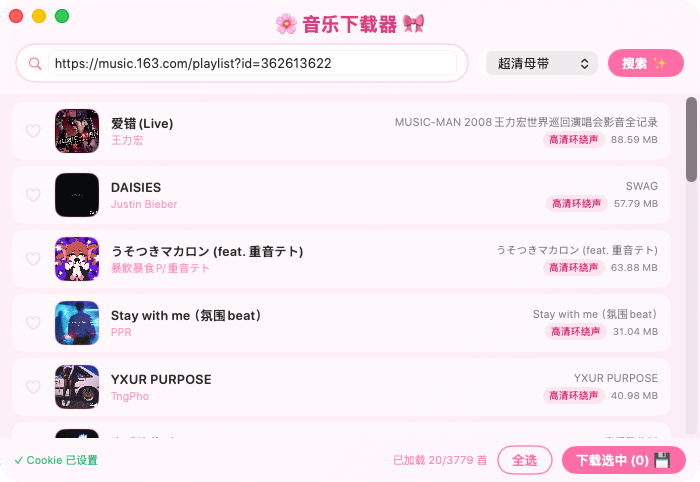

# 🌸 云音乐下载 · Netease Music Downloader

[English](#english) | [中文](#中文)

---

## 中文

一款粉色二次元风格的网易云音乐下载工具，支持单曲、歌单、专辑批量下载。

### 功能特性

- 🎵 支持单曲 ID、歌曲链接、歌单链接、专辑链接
- 🎀 多音质选择（标准 / 高清 / 无损 / Hi-Res / 超清母带）
- 💾 批量下载，自动写入 ID3 标签（封面、歌手、专辑、歌词）
- 🌸 粉色二次元 UI，无原生标题栏

### 使用方法

1. 在输入框粘贴歌曲/歌单/专辑链接
2. 选择音质，点击「搜索 ✨」
3. 勾选想要的歌曲，点击「下载选中」
4. 选择保存目录，等待完成

### Cookie 设置

部分高音质需要登录才能下载，点击左下角 Cookie 按钮，粘贴浏览器中网易云的 Cookie 即可。

### 下载

前往 [Releases](../../releases) 下载最新 DMG。

---

## English

A cute pink-themed macOS app for downloading music from Netease Cloud Music, supporting single tracks, playlists, and albums.

### Features

- 🎵 Supports song IDs, song URLs, playlist URLs, and album URLs
- 🎀 Multiple quality options (Standard / HQ / Lossless / Hi-Res / Master)
- 💾 Batch download with automatic ID3 tagging (cover art, artist, album, lyrics)
- 🌸 Pink anime-style UI with hidden title bar

### Usage

1. Paste a song / playlist / album URL into the input field
2. Select quality and click「搜索 ✨」(Search)
3. Select the songs you want and click「下载选中」(Download Selected)
4. Choose a save directory and wait for completion

### Cookie Setup

Some high-quality formats require a login. Click the Cookie button in the bottom-left corner and paste your Netease Cloud Music cookie from the browser.

### Download

Go to [Releases](../../releases) to download the latest DMG.

---

> Made with 🌸 by [lovelinessmoe](https://github.com/lovelinessmoe)
